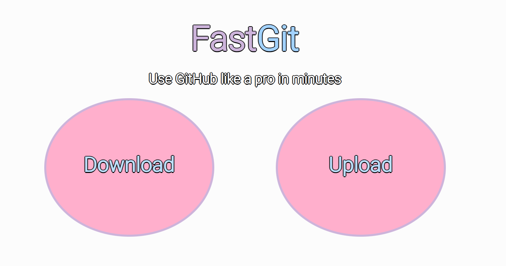

# fastGit

This website will help you to **Use GitHub like a pro in minutes**. If you want to learn how to really understand how to work with compas and have a very nice github repository, just use it.

# Images

## Creator
Made up by sleepyrazor. If you got any ideas of the website please just text me at **manuelrevueltareyes@gmail.com**